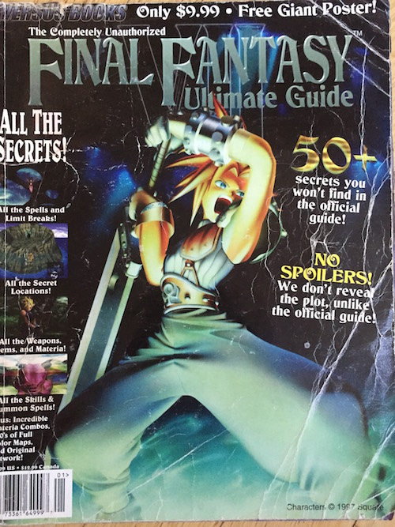
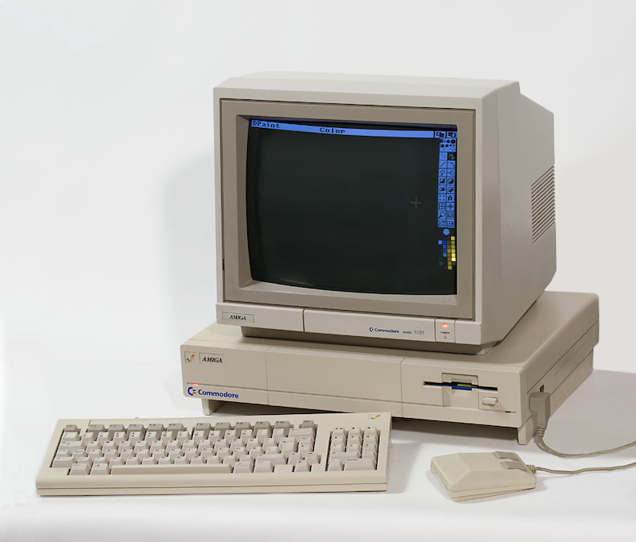
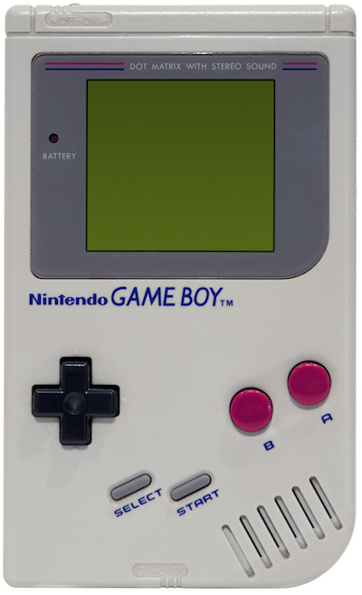

# Digital Creative History

Hey. The name's Jeff. I love to learn, experiment, and create.

My digital authorship is generalled signed with  "featherless". This repo is the index of my
[featherless](https://github.com/featherless) org where I attempt to capture reflections on the
works I've taken part in.

Welcome to my digital creative history. It will always be a work in progress.

---

What follows is a reverse-chronological timeline. **As you scroll down you move further into my
past**. Creations are bucketed by month and I provide my annual birth date for a reference point.

---

### Today

Working at Google. I mentor teams interested in operating in the open. I advise on
designing shared software libraries that are used across Google's 80+ shipping iOS
applications. More and more I'm mentoring Googlers on the Swift language.

Read my personal blog at [design.featherless.software](http://design.featherless.software/).

### 2015: August

Camped with Robot Heart at Burning Man for the second time. Rigged the lights for Shady Bot, the
Heart, and helped with Brandeaux.

## ↑ turned 28 ↑

### 2014: November

Returned to work at Google on the [Material design team](https://design.google.com/) to complete
the work I started just before leaving in 2013.

### 2014: October

Lit Brandeaux for Robot Heart's annual halloween fundraiser.

### 2014: August

Camped with Robot Heart at Burning Man for the first time. Helped light up the Shady Bot art car.
Also left mid-way through burn week to fly directly to a friend's wedding in Toronto!

[Learn more about ShadyBot](https://github.com/featherless/ShadyBot).

## ↑ turned 27 ↑

### 2013: August

Organized camp Pixel Heart + Buddha Lounge on the Burning Man esplanade at the 7:30 portal.

[See pictures, schematics, and learn more about the Pixel Heart camp](https://github.com/featherless/PixelHeart-Esplanade)

## ↑ turned 26 ↑

### 2013: July

Brought the Pixel Heart to Lightning in a Bottle.

[See pictures and learn more about our Lightning in a Bottle experience](https://github.com/featherless/PixelHeart-LightningInABottle)

### 2013: April

I left the Google Maps iOS team after shipping v1.1 in order to travel.

I practiced my first official "step-down" process by going out of my way to hand off responsibility
to other members of the team. [mog](https://github.com/stephanemoore), for example, took ownership
of much of the day-to-day nimbus maintenance.

### 2012: December

Shipped Google Maps iOS after just six months of development.

Invested significant effort in polishing the app's user experience.

I also built the foundation for what became Google's Material design iOS efforts during this time.

The app received high praise by the press:

  - Mobile App of the Year. Crunchies 2012.
  - Best User Experience. Webby Awards 2012.
  - Best Use of GPS. Webby Awards 2012.

### 2012: October

Built the "bottom drawer" gesture-driven interface as part of Google Maps iOS.

I took great care to polish the behavior of the bottom drawer. Notable behavior includes:

- the ability to dismiss the full-screen content by dragging down past the top,
- the ability to toss the drawer into a full-screen mode in a natural manner,
- support for mid-expansion and full-expansion.

One thing I would have liked to improve is for content to detach momentarily as the rubber-banding
is taking effect the content. This would provide a better hint to the: a toss to the top
user for how to dismiss the content.

## ↑ turned 25 ↑

### 2012: February

Moved to a new team at Google.

I moved to the Google+ games iOS team where I built and documented
[a significant amount of the API](https://developers.google.com/games/services/ios/quickstart).

### 2011: September

Started my first full-time salaried job at Google.

I joined the Google+ team. I initially worked on the Google+ iPad app.

## ↑ turned 24 ↑

### 2011: June

Started working on the [Nimbus iOS libraries](http://nimbuskit.info).

I joined the Google+ team. I initially worked on the Google+ iPad app.

## ↑ turned 23 ↑

## ↑ turned 22 :: graduated university ↑

## ↑ turned 21 ↑

## ↑ turned 20 ↑

## ↑ turned 19 ↑

### 2006: March

Won 1st place for [Hunger Strike!](https://github.com/featherless/HungerStrike) in the
[72 hour game development competition](https://github.com/featherless/72hourgdc).

[Get the source to the game and see some paper scribbles](https://github.com/featherless/HungerStrike).

## ↑ turned 18 :: entered university ↑

## ↑ turned 17 :: entered grade 12 ↑

## ↑ turned 16 :: entered grade 11 ↑

### 2003: February or March

Lost a significant amount of data due to a wiped hard drive.

> One note on the bad-side my computer's harddrive was wiped, therefor
> clearing every single one of the calculator programs that I've ever created, so I lost most of the
> new Raging Flame engine and such, but most of the stuff is recreatable, I just haven't really had
> the will to do so recently, and I'm also developing video games for the computer now, so I guess
> I've moved on, heh.

## ↑ turned 15 :: entered grade 10 ↑

### 2002: July

Composed simple songs in FruityLoops.

[Listen to them on Soundcloud](https://github.com/featherless/high-school-compositions).

### Early-to-mid 2002

Wrote a TI83+ programming tutorial.

                             _   _    ___    _   _   _     _______    ___
                            | | | |  / _ \  | | | | | |   |__   __|  /   \
                            | |_| | | / \ | | | | | | |      | |    | / \ |
                            |  _  | ||   || | |_| |_| |      | |    ||   ||
                            | | | | | \_/ | |         |      | |    | \_/ |
                            |_| |_|  \___/   \_______/       |_|     \___/

                                         Program on the TI83+
                                       \~--------------------~/

                                           Table of Contents
                                        \~------------------~/
                                         \                  /
                                          \                /
                                           \              /
                                            \            /
                                             \          /
                                              \        /
                                               \      /
                                                \    /
                                                 \  /
                                                  \/

                    Section 1..............Introduction
                    Section 2..............Getting Started (With programming)
                    Section 3..............The next level....
                    Section 4..............Time to CLEAR some things up!
                    Section 5..............While loops are just the same
                    Section 6..............Input and Output, not as confusing as they seem

[Read the rest in all its ASCII glory](https://github.com/featherless/ti83plus-tutorial).

### 2002: February

Released Raging Flame 2: Legend of Krynn. [Learn more](https://github.com/featherless/ti83plus).

### 2002: January

Released Epic: an interactive story. [Learn more](https://github.com/featherless/ti83plus).

Released TileFlip, a bejeweled clone. [Learn more](https://github.com/featherless/ti83plus).

## ↑ turned 14 :: entered grade 9 ↑

### 2001: June-August

Taught myself how to write TI83+ graphing calculator apps using TIBasic.

[View videos and screenshots of the games](https://github.com/featherless/ti83plus)

## ↑ turned 13 :: entered grade 8 ↑

### learned that code can be written

Not until a friend of mine showed me that he could edit the source to a website did I realize
that it was within my reach to write my own computer programs.

## ↑ turned 12 :: entered grade 7 ↑

## ↑ turned 11 :: entered grade 6 ↑

### Inspiration from late 1997: played Final Fantasy 7 for the first time

Final Fantasy 7 blew Super Mario RPG out of the water for me. I spent countless hours playing
FF7, poring over the strategy guide, even drawing the characters from the strategy guide.

## ↑ turned 10 :: entered grade 5 ↑

### Inspiration from late 1996: played Super Mario RPG for the first time

This was the first "RPG" I ever played. The characters + story + gameplay mechanics all drove
me to play through the entire game in a way that no other game had for me to that point.

## ↑ turned 9 :: entered grade 4 ↑

## ↑ turned 8 :: entered grade 3 ↑

I spent a good deal of my second and third grade years making "paper platformer" games.
I would take a piece of paper, fold it down the middle vertical and then make four
equally-spaced horizontal cuts. This allowed me to make a "book" with a front and back cover
and 7 internal "full-width" pages.

Each full-width page was a hand-drawn level that looked like a cut-out side view of a building.
There were monsters that you'd have to blow up with bazookas, trampolines to jump over chasms
with, and ladders to move between levels.

Thinking back on it now, I think I may have been inspired by and attempting to recreate Bugs
Bunny for the Game Boy. I wasn't allowed to bring my Game Boy to school, so I'd draw these paper
games and play them on the bus instead.

## ↑ turned 7 :: entered grade 2 ↑

### cleaned my room and received my dad's old Amiga

This was my first distinct memory I have of working very hard for something that I wanted.
I made that room *spotless*.

Included:

- Prince of Persia
- King's Quest

## ↑ turned 6 :: entered grade 1 ↑

## ↑ turned 5 :: received an original game boy ↑

### Born in 1987
