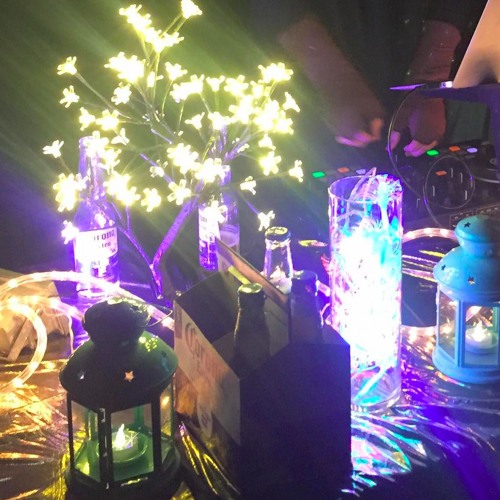
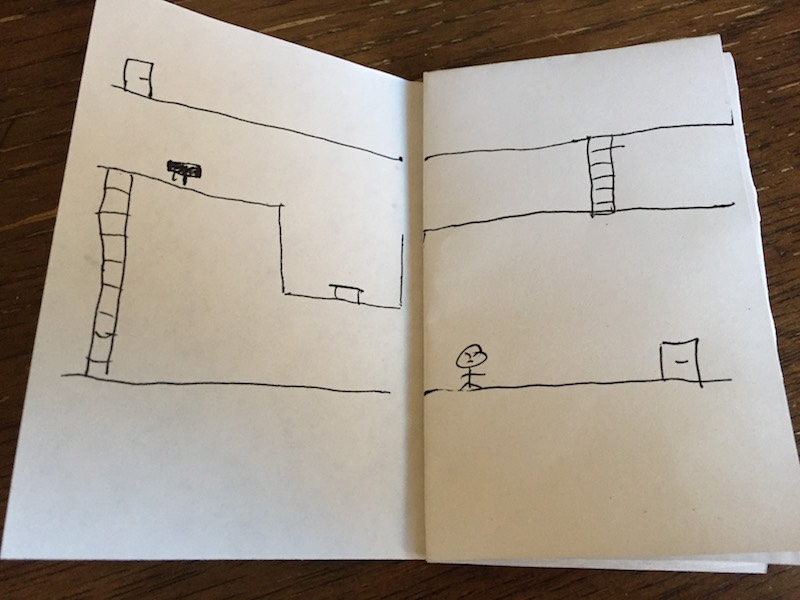

# Digital Creative History

Hey. I love to learn, experiment, create, and share.

My digital authorship is penned "featherless". This repo is an attempt to capture reflections on the
works I've taken part in.

Welcome to my digital creative history. It will always be a work in progress.

---

What follows is a reverse-chronological timeline. **As you scroll down you move further into my
past**. Creations are bucketed by month and I provide my annual birth date for a reference point.

---

### Today

Working at Google. I mentor teams interested in operating in the open. I advise on
designing shared software libraries that are used across Google's 80+ shipping iOS
applications. More and more I'm mentoring Googlers on the Swift language.

Read my personal blog at [design.featherless.software](https://github.com/featherless/blog/tree/master/_posts).

### 2016: September

Writing accompanying my [2016 day 271 mix](https://soundcloud.com/featherless/2016-day-271):

    Two waves collide and build a rebellious harmony.
    Accustomed to discord, to chaotic dissonance,
    to peaks met with valleys and valleys, peaks,
    this beautiful amplification, this synchronous resonance
    is but a forgotten friend. Remember.

Writing accompanying my [2016 day 270 mix](https://soundcloud.com/featherless/2016-day-270):

"Happiness can be felt like floating in the wake of a passing ship, the intensity rising with the wave's edge and settling once more with new, ever-softening oscillations that persist long after the vessel has passed. Happiness in this light is unavoidable and altering. How we *receive* happiness depends entirely on us. Do we allow ourselves to be lifted? Do we hide beneath the surface? Are we anchored to the ocean floor and pulled beneath the water as the wave passes over us? Or are we buoyant, absorbing the energy and seeing past the horizon because of the ephemeral elevation?

The term buoyant has two meanings: "able to stay afloat" along with "cheerful and optimistic". I think that we become most open to the energy brought by happiness when we allow ourselves to be buoyant.

I believe that buoyancy is an innate human trait. As childhood optimism evolves into caution and eventually skepticism, we often begin to feel that this innate trait is a skill that must be practiced. The problem with this mentality is that it places buoyancy in the same prioritization queue as other skills, such as a job or maintaining social status. What if, instead of treating buoyancy as a skill, we evaluated the existing priorities in our life and whether or not they are enabling us to float? How might we best structure our lives to be lifted by happiness when it washes over us? Are our actions and routines anchoring us down, or are they enabling us to be buoyant?"

### 2016: August

Writing accompanying my [2016 day 257 mix](https://soundcloud.com/featherless/2016-day-257-les-post-dust):

"The dust gets in everything. Your clothes. Your heart. Your mind. Decompression this year felt fine until I had a moment to myself, to settle in and reflect on a truly immersive burn. Suddenly the dust came pouring out.

In this day, where most of our Familial connections are sustained across borders through digital wires, the value of having, even for a brief period of time, so much Family within biking distance is immeasurable. As our Families scatter to the winds across the land and sea again, I'm immensely grateful for each moment of ephemeral playa serendipity and for that brief feeling of being truly at Home."

### 2016: August

Solo-camped on the playa. Building nothing was wonderfully cathartic.

↑ turned 29 :: 2016 ↑

---

---

### 2016: June

Began development of Material Motion in the open. [Weekly updates](https://material-motion.gitbooks.io/material-motion-team/content/weekly_updates/).

### 2016: April

Had a blast making one hour of a 24 hour mix collection of music with a friend.

[The Facebook post](https://www.facebook.com/photo.php?fbid=10102507563304900&set=a.10101448998781690.2346833.6912638&type=3&theater)

[Check out the entire 24 hours](http://0024soundtrack2016.tumblr.com/)

[Our mix, under the name m i t t e n s n m o c h i](https://soundcloud.com/mittensnmochi/2300h)

### 2016: January

I started learning how to mix electronic music using a Traktor Kontrol S2. I made a goal for myself
to do two things as often as I could:

- Listen to 100 new tracks from Soundcloud.
- Make a mix.

I listen to a lot of electronic music so I also spin a lot of different kinds of sets. I don't plan
to focus on any one genre over another until I feel that my technical skills have developed. My
primary goal is to keep having fun while doing this.

[Listen to all sets I've made thus far on Soundcloud](https://soundcloud.com/featherless/sets/locally-grown-artisanal-sets).

### 2015: August

Camped with Robot Heart at Burning Man for the second time. Rigged the lights for Shady Bot, the
Heart, and helped with Brandeaux.

↑ turned 28 :: 2015 ↑

---

---

### 2014: November

Returned to work at Google on the [Material design team](https://design.google.com/) to complete
the work I started just before leaving in 2013.

### 2014: October

Lit Brandeaux for Robot Heart's annual halloween fundraiser.

### 2014: August

Camped with Robot Heart at Burning Man for the first time. Helped light up the Shady Bot art car.
Also left mid-way through burn week to fly directly to a friend's wedding in Toronto!

[Learn more about ShadyBot](https://github.com/featherless/ShadyBot).

↑ turned 27 :: 2014 ↑

---

---

### 2014: January

Please note, what follows is an **emotionally sensitive post**. Please leave now if you'd rather not read it.

---

#### certainty and taxes

Hey Mom, how're you feeling?

Pretty crummy!

Drink lots of soup! And make sure to get some sleep. Do you think you'll be able to help me with my taxes this year?

Of course.

Awesome, thanks Mom! Gotta go, gonna work on some projects. Love you bye!

Love you bye!

<i>click</i>

---

    Year: 2010
    Age: 22
    First week, final term - Computer Sci. undergrad

It’s a Thursday morning and I'm hungover.

My phone is making this *abundantly* clear as it's rattling along the wooden floor. *The alarm*. Damn it. I don't want to wake up right now. Blurred numbers fade into focus on the clock beside me: **early**.

It’s the first week of my last term in school. In four months I'm starting my first full-time software engineering position. Things are looking great. My weekly schedule involves sleeping in every day and having a three day weekend, giving me plenty of time for side projects. I think today I'll work on the website for the uwdata api...wait, *why the hell is my alarm on?*

The phone's on its face. I flip it over and reflexively start disabling the alarm.

It’s not my alarm.

My cell phone’s ringing.

*Home*, it glows.

> My mom and 17 year old sister both live in Alberta, two time zones behind me at the time. Early rising was not our thing. This call...this call is peculiar.

Ah well - a quick drag of my finger across the screen and I lay the phone on the side of my head. I'm still in bed.

“Waddaaap”

“She's not”

> It's my sister. I can't make out what she says because she starts sobbing.

"Jess, what's going on?"

"She's not, she's not....she's not BREATHING"

> *Jesus, what is she talking about?*

“What do you mean Jess?”

"It's mooooom, she's not breathing!!!"

"What? What happened?"

> I’m sitting up.

"She's not breathing!!"

"Jess slow down everything's going to be ok did you call 911?"

"Yeeeeeesss the paramedics are here right now but she's not breeeeeathing!"

"Ok tell me what happened.”

> *This can’t be real.* My entire attention is focused on my sister's voice.

> *Please. Please don't let this be as bad as it's sounding.*

"I came upstairs *sob* to go to school and *sob* Mom hadn’t come downstairs *sob* to wake me up which was weird *sob* so I was about to leave for school *sob* but I went to check on her in her room *sob* and she was laying on the side of the bed *sob* weirdly with her legs off the side”

> She's hyper-ventilating.

"Jess slow down. Take a deep breath. Keep telling me what happened.”

“…I said to her 'Moom why are you laying down like that?' because she was half on the bed and it was really weird but when I went over to her she was blue and cold oh my gooood I tried to do CPR but she was so heavy when I tried to pull her off the bed and she won’t wake uuuuup“

> *fuck. fuck fuck fuck*

"Ok you did as much as you could Jess. You called 911 and the paramedics are helping her right?”

"Yeeeeah they're in the bedroom right now why isn't she breeaaathing?"

"Jess it's ok I'm sure the paramedics will be able to hel..."

I hear a voice in the background and my sister drops the phone.

> I will never, ever forget that scream for the rest of my life.

I'm staring at my bedsheets. Or maybe nothing. Everything is blank.

A new voice is speaking on the phone. It's Jess's boyfriend.

"One of the paramedics just came out of the room. I’m sorry. Your mother's passed away."

*nothingness*

---

The next twelve hours blur. I call my granddad, my dad, and my girlfriend at her work. We arrived in Edmonton that evening and met my sister at her boyfriend's house.

It still hadn't hit me.

It didn't hit me Friday when we went to see the body, or on Mother's Day the following day, or even after we gave the first funeral service on Tuesday. I somehow managed to sing the Irish Blessing with my grandfather.

I was back home in Waterloo, sitting at the kitchen table by myself. A full week later. Thursday, 3am.

I cried. I cried, and cried, and cried. I cried at the un-realness of it, at the cruelty of it, at the thought that my sister and I had just had the one person who mattered most to us taken away without so much as a hug, a kiss, or even a simple goodbye. Who would help my sister at her wedding? Who would be there for our graduations, crying with pride? Who would we play pranks on at Christmas every year?

The closeness of the idea that one can be of visibly fine health one evening and the next morning not make it out of bed shook me to the core. How does one move forward when the prospect of death becomes so permanently real? What if you might not be able to say "bye" to the ones you love?

Maybe the last thing you’ll talk to them about will be taxes.

---

*My mother died because of a pulmonary embolism on May 6, 2010.*

---

Life after death modified my behavior in subtle, powerful ways.

The concept that anyone close to me could disappear forever became the forefront of my thinking. I could disappear forever.

My initial reaction was to throw myself into my work, to hide behind the short-term feedback loop of skill and hard work. To create and build as much as I could as fast as I could because every piece of my being could be extinguished in a heartbeat, or lack thereof.

This burnt me out.

I learned a valuable lesson as a result of giving myself entirely: happiness must be shared, not given. You can give and give and give only to be left empty, with no happiness left for yourself. But when you find people to share with, then happiness has a way of returning to you, of fulfilling you, of nurturing your soul and causing you to overflow with joy.

It was at this point that I began to understand the value of creating open source software. It is why everything that I create is open sourced and the code that I write for companies is written in such a way that it has utility long after I've left. It's why I adopted the idea of "documentation is greater than source".

By ensuring that anything I create can be shared and grown even in my absence, I choose to turn the fear of my own death into a creative outlet, a purpose, and a belief in the value of positivity.

This is also the point when I adopted "work hard to not work hard". Rather than doing the same "work" for 80 hours a week, I began spending twenty or thirty hours, often returning home while the sun was still up. This form of meta-work on myself made me happier, more energetic, and in the end I was still at least as productive as my co-workers. The added-bonus: more time to explore other aspects of life. These explorations fed positively back into my work, making me more productive and needing to spend less time at work.

My mother's death shocked me straight to the core and it wasn't my choice. But I believe that the choices I've made since her death have lead me to a fuller life, a life in which each moment is a precious opportunity to connect to, to share with, and to be challenged by others.

I know that I know very little, but this I know right now: give the best of yourself, whether to friend or acquaintance, because you might not get to clean things up later.

♥

*May the road rise up to meet you. 
May the wind be always at your back. 
May the sun shine warm upon your face; 
and the rains fall soft upon your fields.*

*Until we meet again, my friend, 
may God hold you in the palm of His hand.*

*- Traditional Irish Blessing -*

### 2013: August

Organized camp Pixel Heart + Buddha Lounge on the Burning Man esplanade at the 7:30 portal.

[See pictures, schematics, and learn more about the Pixel Heart camp](https://github.com/featherless/PixelHeart-Esplanade)

↑ turned 26 :: Went backpacking :: 2013 ↑

---

---

### 2013: July

Brought the Pixel Heart to Lightning in a Bottle.

[See pictures and learn more about our Lightning in a Bottle experience](https://github.com/featherless/PixelHeart-LightningInABottle)

### 2013: April

I left the Google Maps iOS team after shipping v1.1 in order to travel.

I practiced my first official "step-down" process by going out of my way to hand off responsibility
to other members of the team. [mog](https://github.com/stephanemoore), for example, took ownership
of much of the day-to-day nimbus maintenance.

### 2012: December

Shipped Google Maps iOS after just six months of development.

Invested significant effort in polishing the app's user experience.

I also built the foundation for what became Google's Material design iOS efforts during this time.

The app received high praise by the press:

  - Mobile App of the Year. Crunchies 2012.
  - Best User Experience. Webby Awards 2012.
  - Best Use of GPS. Webby Awards 2012.

### 2012: October

Built the "bottom drawer" gesture-driven interface as part of Google Maps iOS.

I took great care to polish the behavior of the bottom drawer. Notable behavior includes:

- the ability to dismiss the full-screen content by dragging down past the top,
- the ability to toss the drawer into a full-screen mode in a natural manner,
- support for mid-expansion and full-expansion.

↑ turned 25 :: Launched Google Maps iOS :: 2012 ↑

---

---

### 2012: February

Moved to a new team at Google.

I moved to the Google+ games iOS team where I built and documented
[a significant amount of the API](https://developers.google.com/games/services/ios/quickstart).

### 2011: September

Started my first full-time salaried job at Google.

I joined the Google+ team. I initially worked on the Google+ iPad app.

↑ turned 24 :: joined Google full time :: 2011 ↑

---

---

### 2011: June

Started working on the [Nimbus iOS libraries](http://nimbuskit.info).

### 2011: June

I stopped working on the Facebook iPad app.

### 2010: December

Graduated from university.

↑ turned 23 :: graduated university :: 2010 ↑

---

---

### 2010: June

I took on the Facebook iPad app project as the sole engineer. I worked closely with Brandon
Walkin through this time.

### 2010: May

My mother passed away unexpectedly. I started a habit of writing notes of appreciation to
people. Sometimes I give the note to the person. Sometimes I stick the note in a book I keep
in a safe place. I also started making regular digital backups of my life including tax
filings, employment information, landlord and rental information, and passwords to various
accounts.

### 2009: September to December

Second internship at Facebook.

I worked with Owen Yamauchi and Joe Hewitt on the Facebook iOS app. I took ownership of the
Three20 project after the internship.

↑ turned 22 :: entered fifth year of university :: 2009 ↑

---

---

### 2009: January to April

First internship at Facebook.

I worked on chat.

↑ turned 21 :: entered fourth year of university :: 2008 ↑

---

---

### 2008: May to August

Internship at Google.

I worked on the Google Calendar team. I made it so that event chips are the color of the calendar
you're about to create them on (they used to just always be grey).

### 2007: September to December

Third internship at Sony Creative Software.

↑ turned 20 :: entered third year of university :: 2007 ↑

---

---

### 2007: January to April

Second internship at Sony Creative Software.

↑ turned 19 :: entered second year of university :: 2006 ↑

---

---

### 2006: May to August

First internship at Sony Creative Software.

### 2006: March

Won 1st place for [Hunger Strike!](https://github.com/featherless/HungerStrike) in the
[72 hour game development competition](https://github.com/featherless/2003-2006-72hourgdc).

[Get the source to the game and see some paper scribbles](https://github.com/featherless/HungerStrike).

↑ turned 18 :: entered university :: 2005 ↑

---

---

### 2005: Summer

Redesigned [TheJeffFiles.com](https://github.com/featherless/2004-2007-TheJeffFiles).

↑ turned 17 :: entered grade 12 :: 2004 ↑

---

---

### 2004: Summer

Created a [LWO file format renderer](https://github.com/featherless/2004-lwo-renderer).

### 2004: March

Rebuilt the [Blood Right 3D engine](https://github.com/featherless/2002-2004-Blood-Right) again, this time with support
for loading real models, moving entities, and particle systems.

### 2004: January

Launched [TheJeffFiles.com](https://github.com/featherless/2004-2007-TheJeffFiles), my personal website:

↑ turned 16 :: entered grade 11 :: 2003 ↑

---

---

### 2003: July

Made a [garage sale application](https://github.com/featherless/2003-GarageSale).

### 2003: Summer

Attended the National Youth Leadership Forum on Technology. This was the first time I visited the
Bay Area.

Prior to the event I collaborated with a group of other attendees to create "The Developers Alliance".
As part of this group we built a game — Escape from the Funky Factory — and presented it at the
conference.

### 2003: May 3 to July 26

Created [Escape from the Funky Factory](https://github.com/featherless/2003-EscapeFromTheFunkyFactory) in collaboration with The Developers Alliance.

[View the documentation](http://featherless.github.io/2003-EscapeFromTheFunkyFactory/)

### 2003: March

Created the [Script-and-Go scripting language for OpenGL](https://github.com/featherless/2003-script-and-go).

    /*  Script-and-Go code by Jeff Verkoeyen,
    	created 2003	*/
    
    VARIABLES;
    	@int integer;
    	@float integer2;
    	@char testing;
    
    	testing="hey";
    
    	integer2=34;
    
    BEGIN;
    	integer+234;
    	DrawMode("front","lines");
    	Reset;							// Equivalent to LoadIdentity
    	DisableTextures;				// Disables the textures
    	Move(0,0,-100);					// Moves the line back on the z-plane
    	SetColor(1.0f,0.5f,0.25f,0.0f);	// Sets the color to orange
    	DrawLine(0,0,0,38,20,0);		// Draws the line
    	DrawLine(30,20,0,-10,-30,40);	// Draws another line, but closer
    
    	Reset;
    	Move(0,0,-100);
    	SetColor(1.0f,1.0f,0.0f,0.5f);
    	Rotate(integer,1.0f,0.0f,0.0f);
    	Move(10,20,0);
    	Box(-10,10,0,10,10,0,10,-10,0,-10,-10,0);
    END;

### 2003: February or March

Lost a significant amount of data due to a wiped hard drive.

> One note on the bad-side my computer's harddrive was wiped, therefor
> clearing every single one of the calculator programs that I've ever created, so I lost most of the
> new Raging Flame engine and such, but most of the stuff is recreatable, I just haven't really had
> the will to do so recently, and I'm also developing video games for the computer now, so I guess
> I've moved on, heh.

### 2003: February

Working on the 3d version of the [Blood Right](https://github.com/featherless/2002-2003-Blood-Right) game.

### 2003: January

Created a new game called [JetPack Jack](https://github.com/featherless/2003-JetPack-Jack).

### 2002: November

Began my biggest project yet: [Blood Right for the computer](https://github.com/featherless/2002-2003-Blood-Right).

### 2002: October

Wrote a [beginner's C++ tutorial](https://github.com/featherless/2002-cplusplus-tutorial)

### 2002: Fall

Created my first OpenGL C++ game: [Asteridiaz](https://github.com/featherless/2002-Asteridiaz).

↑ turned 15 :: entered grade 10 :: 2002 ↑

---

---

### 2002: July

Composed simple songs in FruityLoops.

[Listen to them on Soundcloud](https://github.com/featherless/high-school-compositions).

### 2002: June

Began learning C++ by making [simple DOS games](https://github.com/featherless/2002-dos-games).

Arcade:

Roidian:

Galaxiados:

### 2002: April

Began work on v3 of the Raging Flame TI83+ game.

### Early-to-mid 2002

Wrote a TI83+ programming tutorial.

                             _   _    ___    _   _   _     _______    ___
                            | | | |  / _ \  | | | | | |   |__   __|  /   \
                            | |_| | | / \ | | | | | | |      | |    | / \ |
                            |  _  | ||   || | |_| |_| |      | |    ||   ||
                            | | | | | \_/ | |         |      | |    | \_/ |
                            |_| |_|  \___/   \_______/       |_|     \___/

                                         Program on the TI83+
                                       \~--------------------~/

                                           Table of Contents
                                        \~------------------~/
                                         \                  /
                                          \                /
                                           \              /
                                            \            /
                                             \          /
                                              \        /
                                               \      /
                                                \    /
                                                 \  /
                                                  \/

                    Section 1..............Introduction
                    Section 2..............Getting Started (With programming)
                    Section 3..............The next level....
                    Section 4..............Time to CLEAR some things up!
                    Section 5..............While loops are just the same
                    Section 6..............Input and Output, not as confusing as they seem

[Read the rest in all its ASCII glory](https://github.com/featherless/ti83plus-tutorial).

### Early 2002

Created the TI Project Development Area website. Began hosting all of my TI83+ games and software on
the site as well as writing tutorials.

[Learn more about the site](https://github.com/featherless/ti83plus-site).

### 2002: February

Released Raging Flame 2: Legend of Krynn. [Learn more](https://github.com/featherless/ti83plus).

### 2002: January

Released Epic: an interactive story. [Learn more](https://github.com/featherless/ti83plus).

↑ turned 14 :: entered grade 9 :: 2001 ↑

---

---

### 2001: January

Taught myself how to write TI83+ graphing calculator apps using TIBasic.

[View videos and screenshots of the games](https://github.com/featherless/ti83plus)

↑ turned 13 :: entered grade 8 :: 2000 ↑

---

---

### Learned that code can be written

Not until a friend of mine showed me that he could edit the source to a website did I realize
that it was within my reach to write my own computer programs.

↑ turned 12 :: entered grade 7 :: 1999 ↑

---

---

↑ turned 11 :: entered grade 6 :: 1998 ↑

---

---

↑ turned 10 :: entered grade 5 :: 1997 ↑

---

---

↑ turned 9 :: entered grade 4 :: 1996 ↑

---

---

↑ turned 8 :: entered grade 3 :: 1995 ↑

---

---

During my second and third grade years I made "paper platformer" games. I would take a piece
of paper, fold it down the middle vertical and then make four equally-spaced horizontal cuts.
This allowed me to make a "book" with a front and back cover and 7 internal "full-width" pages.

Each full-width page was a hand-drawn level that looked like a cut-out side view of a building.
There were monsters that you'd have to blow up with bazookas, trampolines to jump over chasms
with, and ladders to move between levels.

Thinking back on it now, I may have been attempting to recreate Bugs Bunny for the Game Boy.
I wasn't allowed to bring my Game Boy to school, so I'd draw these paper games and play them
on the bus instead.

↑ turned 7 :: entered grade 2 :: 1994 ↑

---

---

↑ turned 6 :: entered grade 1 :: 1993 ↑

---

---

↑ turned 5 :: 1992 ↑

---

---

↑ Born in 1987 ↑

---

---
